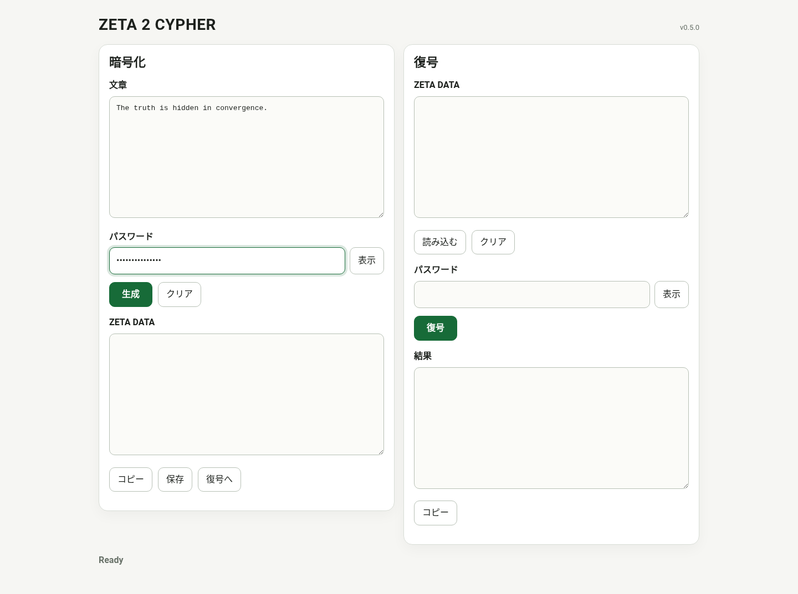

# ZETA 2 CYPHER

<p align="center">
  
</p>

**ZETA 2 CYPHER** is an experimental art cipher based on the convergence of **ζ(2)**.

It converts a message and password into compact **ZETA DATA**.  
The interface is intentionally minimal: no video, no decorative stream, no extra technical display.

## Concept

ZETA 2 CYPHER treats **ζ(2)** as a fixed mathematical field.

The password generates a reading seed.  
That seed determines where the system reads inside the digits of ζ(2): line, digit, jump, inversion, and related coordinates.

The message is transformed through those ZETA-derived coordinates and saved as ZETA DATA.

In short:

```text
message + password
→ ZETA reading seed
→ ζ(2) coordinate reading
→ ZETA DATA
```

## Screenshot

<p align="center">
  
</p>

## How to Use

### Encode

1. Enter a message.
2. Enter a password.
3. Press **生成**.
4. Copy or save the generated **ZETA DATA**.

### Decode

1. Paste or load **ZETA DATA**.
2. Enter the same password.
3. Press **復号**.

If the password is wrong, the message cannot be restored.

## ZETA DATA

The saved package is intentionally small:

```json
{
  "type": "ZETA2CYPHER",
  "version": 2,
  "salt": "...",
  "length": 51,
  "data": "..."
}
```

Only the minimum fields needed for restoration are kept.

## Origin

The project comes from an older Java program, `ZetaKansu.java`, written before AI tools were available.  
That program calculated the zeta function by repeatedly accumulating partial sums.

This app reinterprets that early numerical experiment as a compact cipher tool.

The original Java source is kept in:

```text
legacy/ZetaKansu.java
```

## Deploy

For Cloudflare Pages:

```powershell
cd "$env:USERPROFILE\Desktop\zeta-2-cypher-v05"
npx wrangler pages deploy . --project-name zeta-2-cypher
```

## Note

ZETA 2 CYPHER is an experimental art cipher.  
It is not an audited replacement for standard cryptography.
